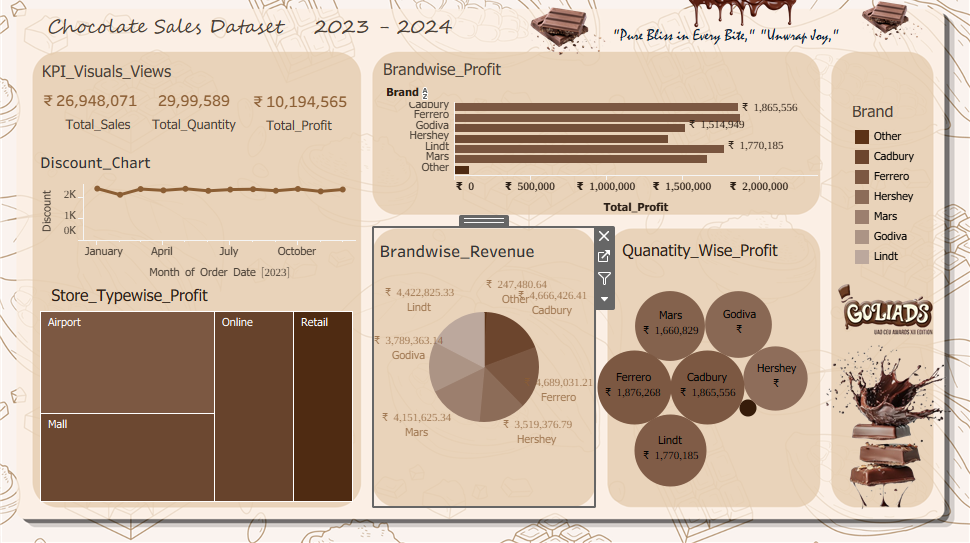

# Chocolate Sales Dashboard (Tableau)

This project presents an interactive Tableau dashboard that analyzes chocolate sales performance across different brands, store types, and time periods. The dashboard helps in understanding key business metrics such as revenue, profit, and sales trends.

## Key Features
- Monthly sales and profit trend analysis
- Brand-wise revenue comparison
- Quantity-wise profit distribution
- Store type performance analysis
- Interactive filters for brand selection

## Insights
The dashboard enables users to identify top-performing brands, understand seasonal sales patterns, and evaluate profitability across different store types. It helps businesses make data-driven decisions to improve sales strategy and product performance.

## Tools Used
- Tableau
- Data Visualization
- Business Intelligence

## Dashboard Preview

